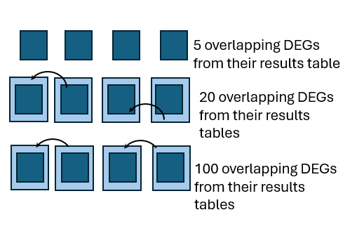
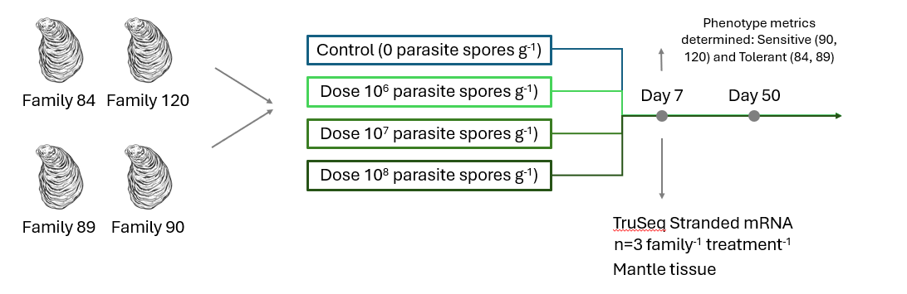
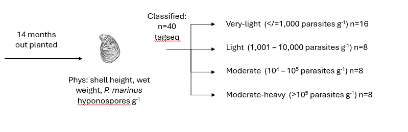
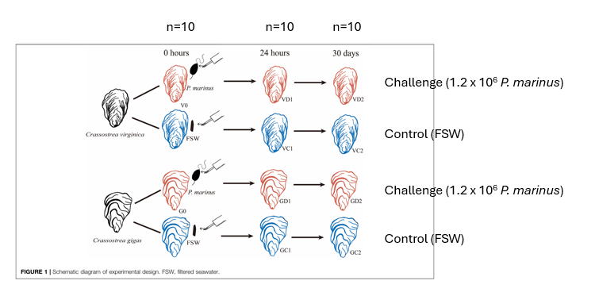
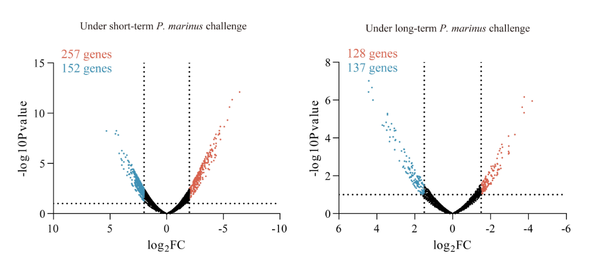
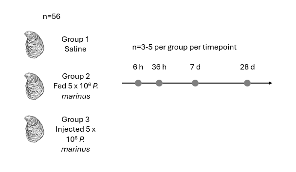
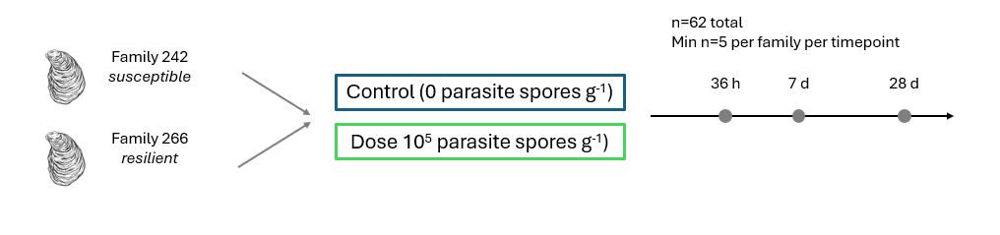

# Slide 1

## Are there biomarkers (DEGs) that overlap across studies?

Can we find these just looking at the data they already analyzed?

Are there more previously identified DEGs overlapping after we systematically reprocess and compare
Use their results short list
Are there new DEGs that come up?

Use this model for all datasets? Overview of R Package lfmm • lfmm; WGCNA; Deseq2; random forest

Gene groups to target after diff exp. Analysis
Immune gene set: 
(find set of genes associated with oyster immunity)
E.g. Cytokines or use GO slim ‘immune response’ 

Compare gene set results tables in papers to our results

5 overlapping DEGs from their results table

20 overlapping DEGs from their results tables

100 overlapping DEGs from their results tables

Perkinsus RNAseq analysis with 4 datasets

# Slide 2

## Overall next steps

### Expand Perkinsus meta-analysis to include other data types 

Methylation (Johnson et al.; other studies?)  
Proteomics  
Metabolomics  
Genomics (WGS, SNP arrays, etc)  
If not enough perkinsus data available, expand disease meta-analysis to include data types from other disease experiments (QPX, MSX, etc)  
RNAseq  
Methylation  
Proteomics  
Metabolomics  
Genomics   
If not enough disease data available, can pivot to environmental factor studies (e.g. temp)

# Slide 3

Disease dataset set #1: Proestou et al. 2023

### Understanding Crassostrea virginica tolerance of Perkinsus marinus through global gene expression analysis

link: https://www.frontiersin.org/journals/genetics/articles/10.3389/fgene.2023.1054558/full 

Oyster origin: Aquaculture Genetics and Breeding Technology Center (ABC) eastern oyster breeding program at the Virginia Institute of Marine Science (VIMS)
Two sensitive and two tolerant eastern oyster families experimentally challenged with distinct doses of P. marinus (0, 106, 107, and 108 parasite spores per gram wet weight, n = 3–5 individuals per family per dose)

### Dataset #1 further notes

RNA-Seq and expression analyses were only conducted on samples from Day 7, since previous research (maybe their own 2020 paper) indicated that this was the peak of infection intensity and transcriptomic response​. As far as I can tell, they didn't do differential expression between control and treatment groups. (Tangentially, that might mean we could add value by doing that.)

# Slide 4

Disease dataset set #2: Johnson et al. 2020

### Characterizing the Epigenetic and Transcriptomic Responses to Perkinsus marinus Infection in the Eastern Oyster Crassostrea virginica

link:  https://www.frontiersin.org/journals/marine-science/articles/10.3389/fmars.2020.00598/full 

Oyster origin: Vermilion Bay, Louisiana & Calcasieu Lake, Louisiana. 5 months acclimation at hatchery then spawned. Spat reared in upwelling system and outplanted to mesh bags. Monitored for mortality and cleaned every 3 months for 14-month period

### Dataset #2 further notes

There was no control group, and samples were only taken at a single time point, after 14 months of outplanting. Most of the interesting results related to differentiated methylation. 

Regarding DEG:
> Differential gene expression analysis identified only 39 genes that showed differential expression between the moderate-heavy (>100,000 parasites g−1) and very-light infected (≤1,000 parasites g−1) individuals (Figure 2). This low level of differential gene expression is comparable to the dampened response (21 genes DEG) observed in a dermo resistant family when measured 28-days post-exposure in a controlled experiment (Proestou and Sullivan, 2020).

But Proestou and Sullivan, 2020 did show significant DEG early on, whereas this study effectively observes only the longer-term changes.

# Slide 5

Disease dataset set #3: Chan et al. 2021

### Transcriptomic Response to Perkinsus marinus in Two Crassostrea Oysters Reveals Evolutionary Dynamics of Host-Parasite Interactions

link:  https://www.frontiersin.org/journals/genetics/articles/10.3389/fgene.2021.795706/full 

Oyster origin: Maine and Washington oyster farms. Acclimated in lab for 24 hours then experimentally challenged

### Dataset #3 further notes

C. gigas was compared with the less tolerant species C virginica. There was a control group for each.

Sample timing (samples from control and treatment groups for each species):
0 (before injection)  
24 h  
30 d  

Apoptosis inhibitors were the focus of a key finding: they were strongly upregulated in resistant C. gigas​, supporting the idea that apoptosis regulation could be an important factor in disease resistance.

#### Notable for our work, regarding C. gigas it says:
> On the other hand, this study and a recent transcriptomic study (Proestou and Sullivan, 2020) shared only 39 DEGs (Supplemenatary Table S4), which could be caused by differences in challenge condition, genetic background or physiological state of oysters used.

Given the great differences between the susceptible family and the resistant family in Proestou and Sullivan, 2020 (Dataset #5), this is not suprising.

#### Even so, it says:
> Second, this study identified 759 and 568 P. marinus induced DEGs in C. virginica and C. gigas [respectively] (Supplementary Figure S3), respectively, with significant overlapping.

I think the 759 number refers to the total across the 24 h and the 30 d samples (surprisingly), because it says:
> 759 genes were differentially expressed in oysters challenged with P. marinus (VD1 and VD2) compared with unchallenged controls (V0, VC1, and VC2) (Supplemenatary Table S2), including 583 DEGs from short-term challenge (24 h) and 273 DEGs from long-term challenge (30 days).

We may be left to infer that the 568 DEG number for C. gigas is also summed over both intervals. Actually, that notion is supported by Supplementary Figure S3:

# Slide 6

Disease dataset set #4: Sullivan and Proestou 2021

### Survival and transcriptomic responses to different Perkinsus marinus exposure methods in an Eastern oyster family

link: https://doi.org/10.1016/j.aquaculture.2021.736831 

Oyster origin: 1 year old from full sibling oyster family 286 from VIMS transported to USDA ARS NCWMAC in RI. Acclimated to lab conditions. All exposed oysters (n = 56 per group) received a dose of 5 × 106 cultured P. marinus cells. Group 2 were fed P. marinus; Group 3 were injected with P. marinus. At 6 h, 36 h, 7 d, and 28 d post-exposure, six live oysters per group were censored and mantle and digestive tissues preserved. For 3-5 per group, measured global gene expression. Throughout, moribund oystered were removed and sampled. At completion at 42 d, remaining oysters were sampled. Samples were sequenced in two batches (fall 2015 and 2017) and expression profiles covaried with batch.

### Dataset #4 further notes

#### The focus was fed vs injected exposure. There were control groups for each.

Only At 6 hours was differential expression analysis conducted vs the control, and this was done only for the fed group. For later time points (36 hours, 7 days, and 28 days), DEGs were analyzed between the fed and injected groups rather than against the control group. (Again, this might be an opportunity for us.)
> Using RNAseq, we identified differentially expressed transcripts between fed and control animals 6 h after exposure and between fed and injected groups at 36 h, 7 d, and 28 d post exposure.

Still, it says that transcriptomic responses were highly time-dependent.

# Slide 7

Disease dataset set #5: Proestou and Sullivan 2020

### Variation in global transcriptomic response to Perkinsus marinus infection among eastern oyster families highlights potential mechanisms of disease resistance

link: https://www.sciencedirect.com/science/article/pii/S1050464819311295?via=ihub#appsec1 

Oyster origin: full sibling oyster families from the Aquaculture Genetics & Breeding Technology Center's (ABC) selective breeding program were challenged with either 5 × 106 P. marinus cells g−1 wet tissue weight (injected treatment) or artificial seawater (control treatment) via injection in adductor muscle tissue 

gene expression analysis focused on mantle tissues collected from two families identified as susceptible (low survival and low parasite elimination rate, family 242) and resistant (high survival and moderate parasite elimination rate, family 266) to P. marinus infection in the laboratory disease challenge

### Dataset #5 further notes

### The paper's interesting result is the difference between the resistant and susceptible families in differential expression over time between control and treated individuals within each family.

Though it says "Significant differences in baseline expression between the two families were revealed when we compared all control samples among families", the main result seems to be that the two families' response curves, if you will, were different.
From 3.3. Differential expression analysis
For the resistant family, number of differentially expressed transcripts relative to resistant control at three time points post-injection:
36 h: 278  
7 d: 387  
28 d: 21  

For the susceptible family, number of differentially expressed transcripts relative to susceptible control at three time points post-injection:
36 h: 99  
7 d: 61  
28 d: 1918

Interestingly, there was "surprisingly little overlap in differentially expressed transcripts among timepoints within each family, suggesting a dynamic host response to the parasite and underscoring the value in assessing expression patterns at different stages of infection."

One implication is that the resistant family mounts a strong initial defense, and wins, so it can then settle back to normal, while the susceptible family defends itself "too little, too late.", ending with a survival probability about 15% lower after 40 days.

# Slide 8

Subsetting the data

* Dataset 1: 
  * CTRL (n = 12-20)
  * 10^8 dosed (n = 12-20)
  * 10^7 dosed (n = 12-20)
* Dataset 2: 
  * CTRL (very light, n =16)
  * Moderate (10^4-10^5, n =16)
  * Moderate heavy (>10^5, n =16)
* Dataset 3: 
  * Dosed C. gigas (n = 5)
  * Dosed C. virginica (n=5)
  * Use all samples
* Dataset 4: 
  * CTRL (n = 12-20)
  * Injected (n = 12-20)
  * Use all time points
* Dataset 5:
  * CTRL (n = 20)
  * 10^5 dosed (n =20)
  * Exclude time point 36 h

